# 3Scale First API

## Description

This module will cover how to create an **API Product, API Backend, Mapping Rules, Application Plan, Application** and promote then to *Staging* and *Production* environment.

## Deployment

0. [Hello World API - Backend](#deploy-helloworld-backend)
1. [Hello World API - Product](#deploy-helloworld-product)
2. [Hello World API - Mapping Rules](#deploy-helloworld-mappingrules)
3. [Hello World API - Application Plans](#deploy-helloworld-applicationplans)
4. [Hello World API - Application](#deploy-helloworld-application)
5. [Hello World API - Promote](#deploy-helloworld-promote)
6. [Hello World API - Test](#deploy-helloworld-test)

### 0. Hello World API - Backend <a name="deploy-helloworld-backend">

* On your **3Scale Home Page** create a *Backend* with the following configuration by clicking on *NEW BACKEND* button:

  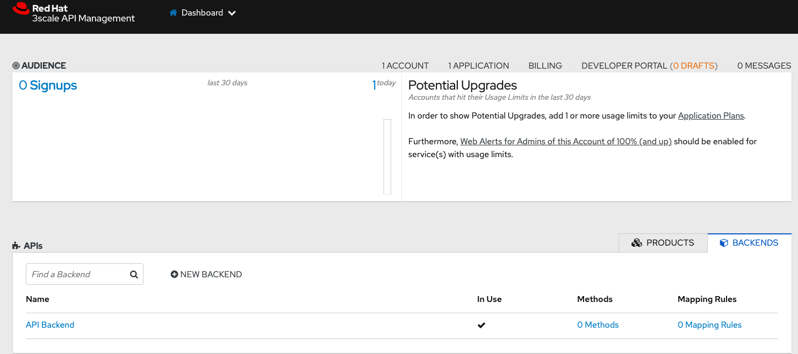

* After configuring your **API Backend**, click on *Create Backend*

  ```
  Name: hello-world-backend
  System name: hello-world-backend
  Private Base URL: https://echo-api.3scale.net/
  ```

  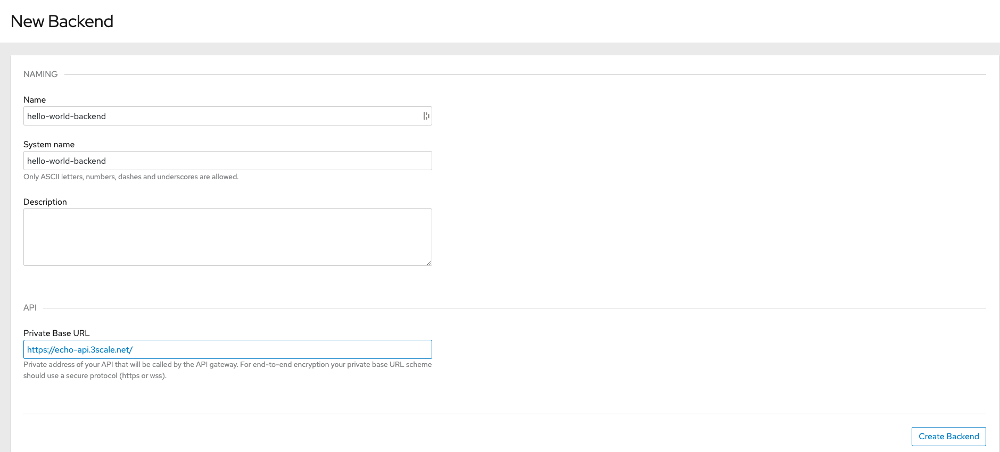

* Switch back to **3Scale Home Page** by selecting *Dashboard*

  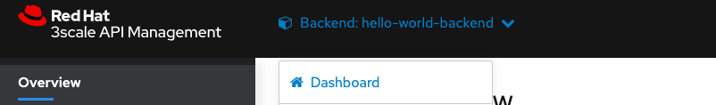

### 1. Hello World API - Product <a name="deploy-helloworld-product">

* On your **3Scale Home Page** create a *Product* by clicking on *NEW PRODUCT* button:

  

* Create a *Product* with the following definition:

  ```
  Name: hello-world-product
  System name: hello-world-product
  ```

  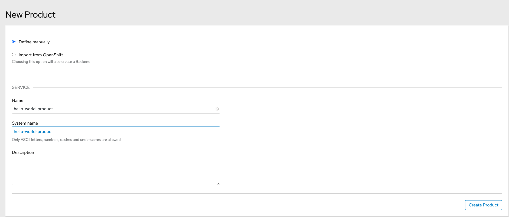

* On **hello-world-product** page, click on *Integration -> Configuration* and finally: *add a Backend and promote the configuration*:

  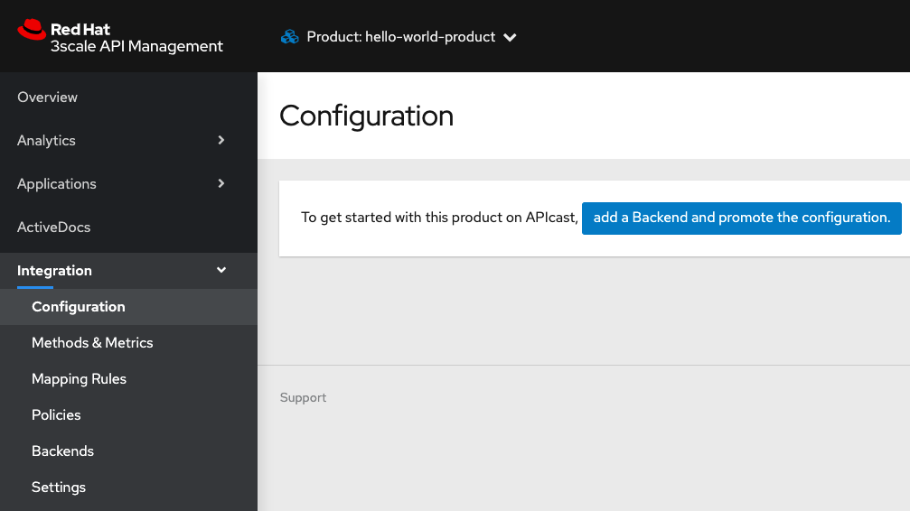

* Select **hello-world-backend** from *Backend* menu and on the *Path* textbox, inform `/`

* Finally click on *Add to Product*

  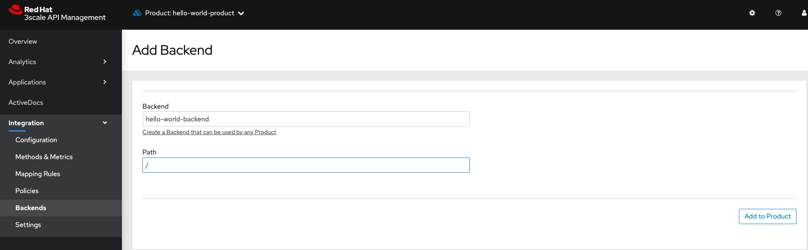

* Confirm that **hello-world-backend** is successfully created

  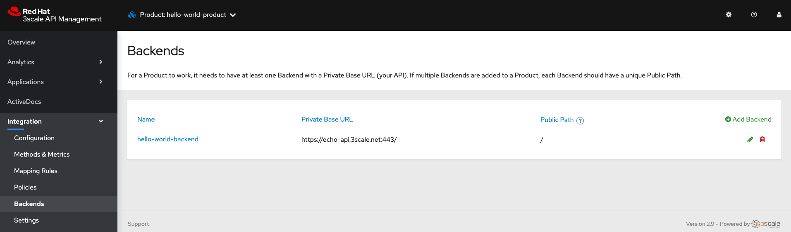

### 2. Hello World API - Mapping Rules <a name="deploy-helloworld-mappingrules">

* Switch back to **3Scale Home Page** selecting *Dashboard*

  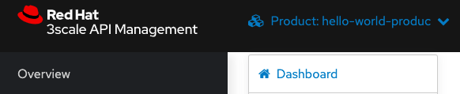

* Edit **hello-world-backend** configuration: *Backends -> hello world backend*

  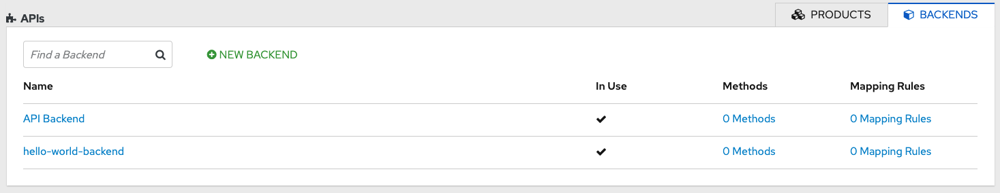

* Click on *Mapping Rules* on the left side menu

  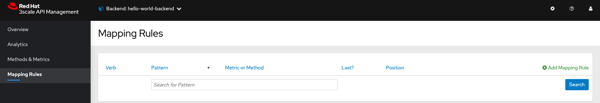

* Click on *Add Mapping Rule* and add a Rule with the following parameters, and afterwards click on *Create Mapping Rule*

  ```
  Verb: GET
  Pattern: /hello
  Metric or method to increment: Hits
  Increment by: 1.
  Last?: blank
  Position: 1
  ```

  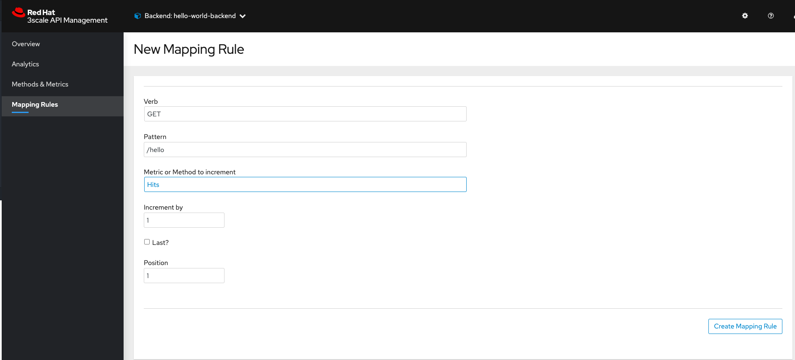

### 3. Hello World API - Application Plans <a name="deploy-helloworld-applicationplans">

* Switch back to **3Scale Home Page** selecting *Dashboard*

  

* Switch to *Products* tab and click on *HELLO-WORLD-PRODUCT API*

  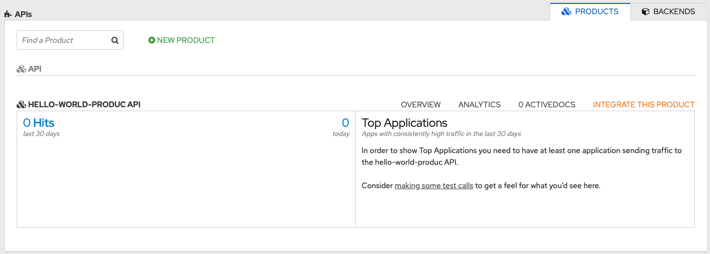

* Click on: *Overview -> Applications -> Application Plan*

  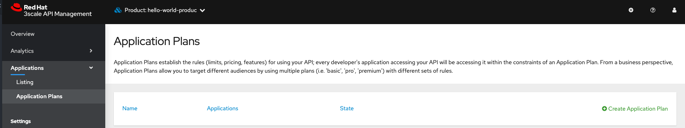

* Click on *Create Application Plan* and define it using the following parameters:

  ```
  Name: hello-application-plan
  System name: hello-application-plan
  ```

  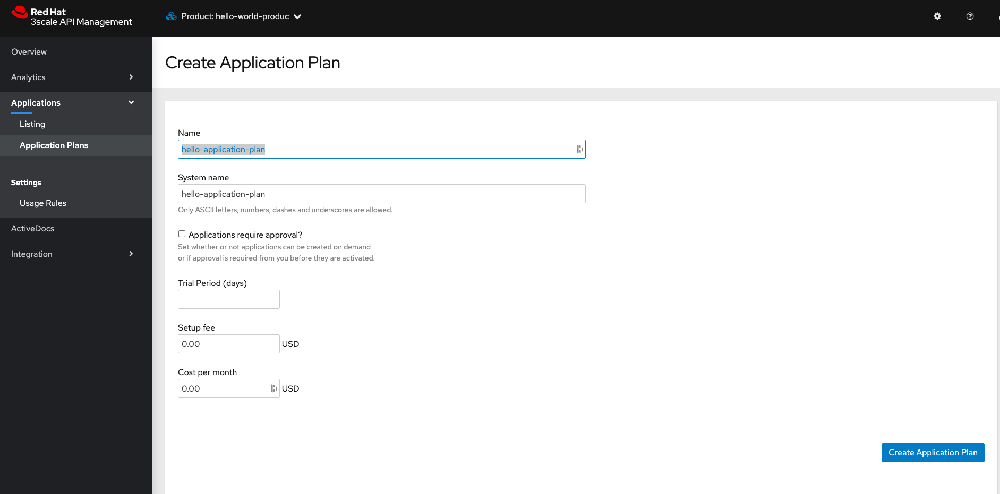

* Finally set **hello-application-plan** as the *Default Plan* and click on *Publish*

  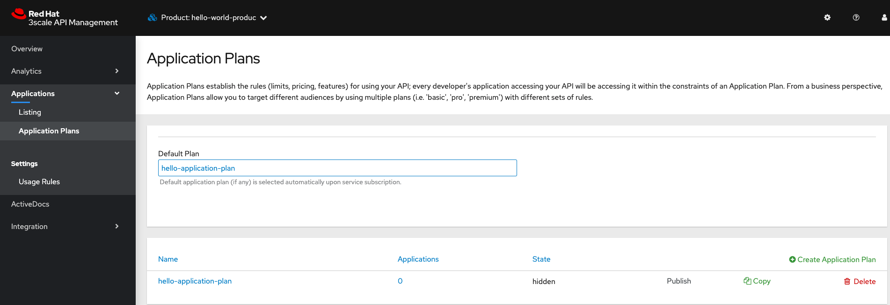

  * wait until **hello-application-plan State** is: *published*

### 4. Hello World API - Application <a name="deploy-helloworld-application">

* Switch to **Audience**

  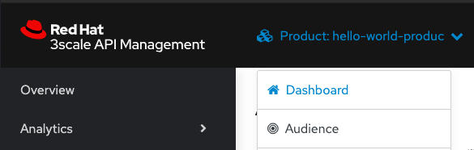

* Click on *Developer*

  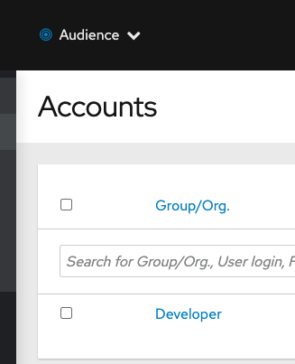

  

* Click on *1 Application* top link and finally select *Create Application*

  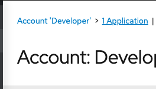

  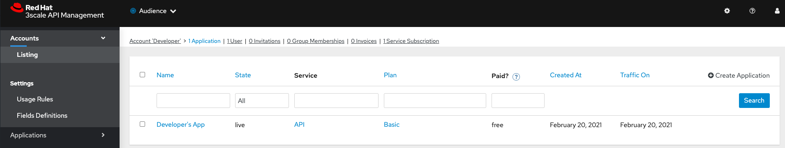

* Define an application with the following configuration and click on *Create Application*

  ```
  Application Plan: hello-application-plan
  Name: hello-world-app
  Description: hello-world-app
  ```

  

  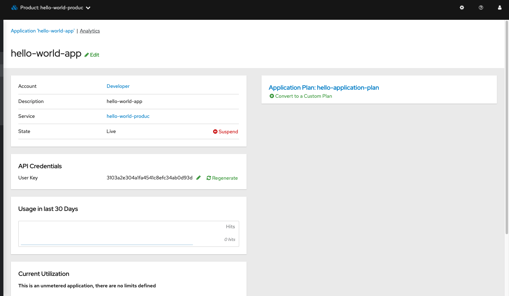

### 5. Hello World API - Promote <a name="deploy-helloworld-promote">

* In the left menu, select: *Integration -> Configuration*

  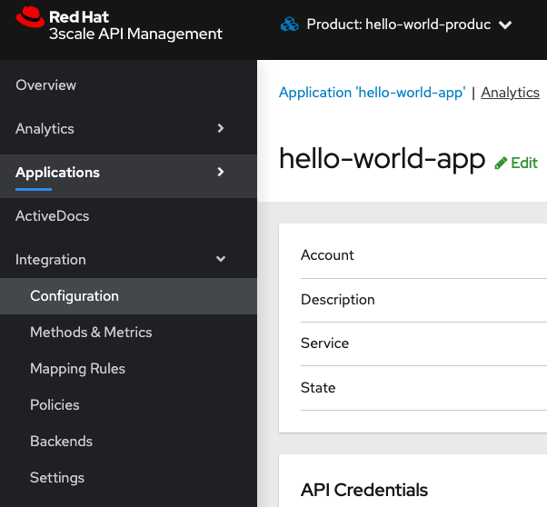

* Promote the **API** by clicking on *Promote v.1 to Staging APIcast*

  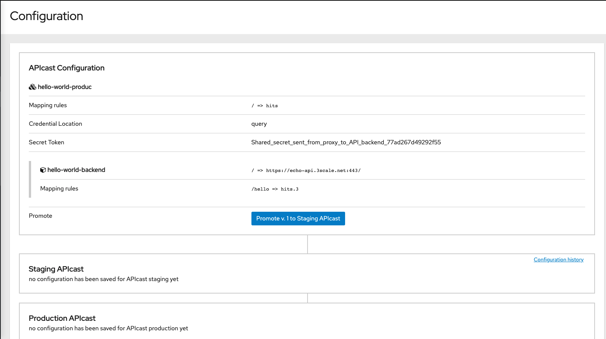

    * take note of *Staging APIcast URL*

* Promote the **API** by clicking on *Promote v.1 to Production APIcast*

  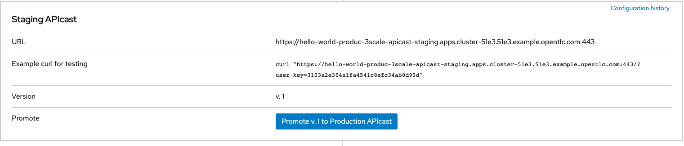

    * take note of *Production APIcast URL*

### 6. Hello World API - Test <a name="deploy-helloworld-test">

* In order to test the **Staging APICast**, just execute a curl on the generated URL:

  ```
  curl "$url:443/?user_key=<yourkey>"

  {
  "method": "GET",
  "path": "/",
  "args": "user_key=$key",
  "body": "",
  "headers": {
    "HTTP_VERSION": "HTTP/1.1",
    "HTTP_HOST": "echo-api.3scale.net",
    "HTTP_ACCEPT": "*/*",
    "HTTP_USER_AGENT": "curl/7.64.1",
    "HTTP_X_3SCALE_PROXY_SECRET_TOKEN": "Shared_secret_sent_from_proxy_to_API_backend_77ad267d49292f55",
    "HTTP_X_REAL_IP": "10.128.2.23",
    "HTTP_X_FORWARDED_FOR": "187.2.139.101, 52.22.150.143, 10.0.101.74",
    "HTTP_X_FORWARDED_HOST": "echo-api.3scale.net",
    "HTTP_X_FORWARDED_PORT": "443",
    "HTTP_X_FORWARDED_PROTO": "https",
    "HTTP_FORWARDED": "for=10.0.101.74;host=echo-api.3scale.net;proto=https"
  },
  "uuid": "3109ab09-4bba-49f6-b034-bc078ed1d923"
  }%
  ```

  

* In order to test the **Production APICast**, just execute a curl on the generated URL:

  ```
  curl $url:443?user_key=$user_key
  {
    "method": "GET",
    "path": "/",
    "args": "user_key=$key",
    "body": "",
    "headers": {
      "HTTP_VERSION": "HTTP/1.1",
      "HTTP_HOST": "echo-api.3scale.net",
      "HTTP_ACCEPT": "*/*",
      "HTTP_USER_AGENT": "curl/7.64.1",
      "HTTP_X_3SCALE_PROXY_SECRET_TOKEN": "Shared_secret_sent_from_proxy_to_API_backend_77ad267d49292f55",
      "HTTP_X_REAL_IP": "10.131.0.17",
      "HTTP_X_FORWARDED_FOR": "187.2.139.101, 50.16.42.192, 10.0.101.74",
      "HTTP_X_FORWARDED_HOST": "echo-api.3scale.net",
      "HTTP_X_FORWARDED_PORT": "443",
      "HTTP_X_FORWARDED_PROTO": "https",
      "HTTP_FORWARDED": "for=10.0.101.74;host=echo-api.3scale.net;proto=https"
    },
    "uuid": "ca1d231b-5b7b-4f32-b246-a338de792f5c"
  }
  ```

  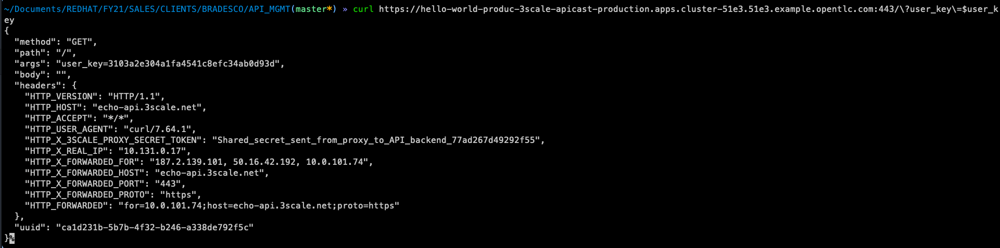


## References

- [3Scale Backend](https://access.redhat.com/documentation/en-us/red_hat_3scale_api_management/2.9/html/glossary/threescale_glossary#backend)
- [3Scale Product](https://access.redhat.com/documentation/en-us/red_hat_3scale_api_management/2.9/html/glossary/threescale_glossary#product)
- [3Scale Mapping Rule](https://access.redhat.com/documentation/en-us/red_hat_3scale_api_management/2.9/html/glossary/threescale_glossary#mapping-rule)
- [3Scale Application Plan](https://access.redhat.com/documentation/en-us/red_hat_3scale_api_management/2.9/html/glossary/threescale_glossary#plan)
- [3Scale Application](https://access.redhat.com/documentation/en-us/red_hat_3scale_api_management/2.9/html/glossary/threescale_glossary#application)
