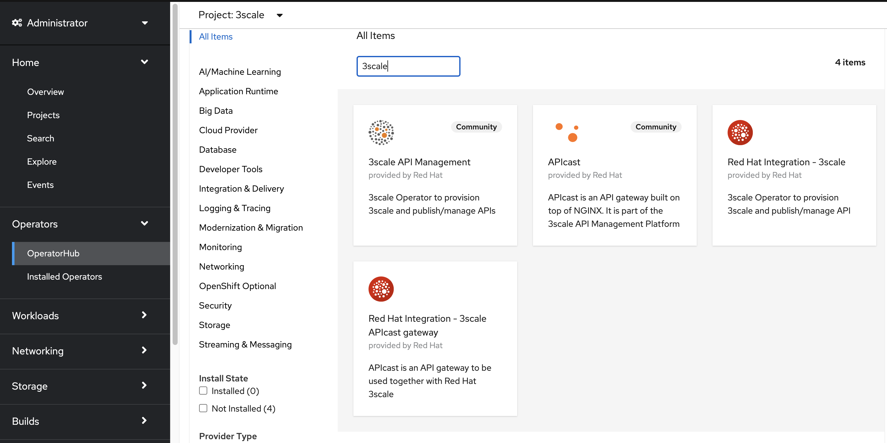
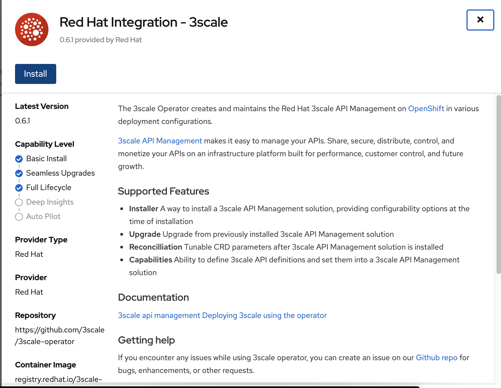
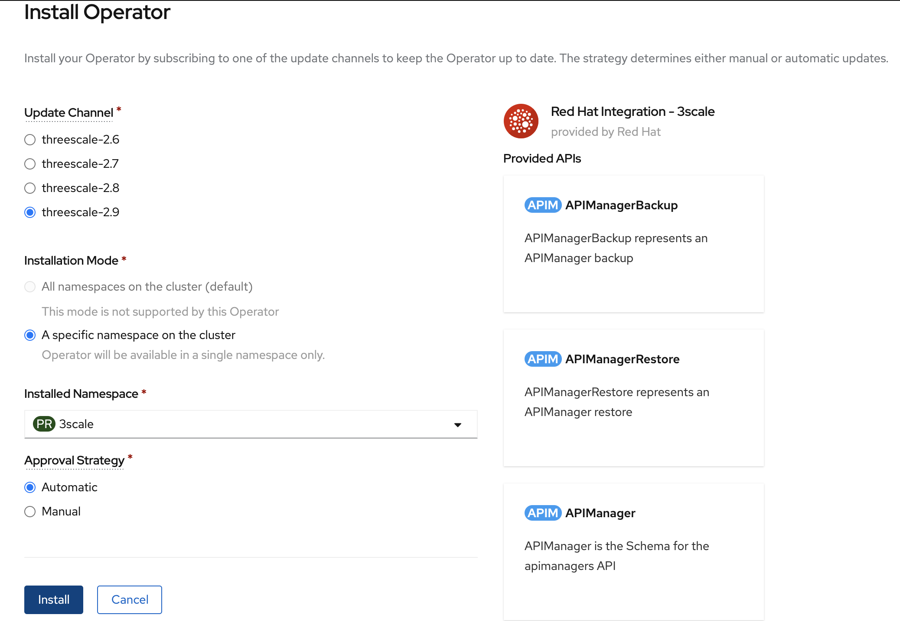
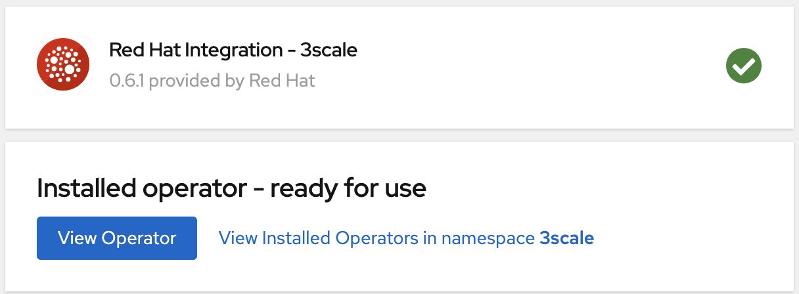
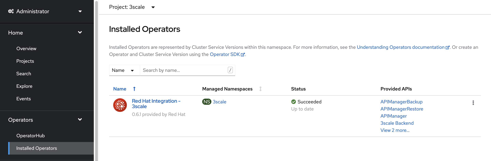

# 3Scale Setup

## Description

This module will cover how to install **3Scale 2.9** on **Red Hat OpenShift 4.6**.

## Deployment

* Create a **3Scale project/namespace**. Example: `oc create namespace 3scale`

* Create a *Kubernetes secret* to fetch images from **Red Hat´s Registry**. Example:

  ```
  oc -n 3scale create secret \
    docker-registry threescale-registry-auth \
    --docker-server=registry.redhat.io \
    --docker-username="someuser" \
    --docker-password="password"
  ```

* Deploy **3Scale Operator** onto **3Scale project/namespace**:
  `Operators > OperatorHub > Red Hat Integration - 3scale`

  

  

  

  * don´t forget to select **3Scale project/namespace**

* Wait for the installation to finish. Before moving forward, we suggest double-checking the successfully deployment of **3Scale´s Operator**:

  

  

* Via *api-resources:*

  ```
  oc api-resources | grep apimanagers
  apimanagers     apps.3scale.net     true      APIManager
  ```

## References

- [3Scale Installation Guide](https://access.redhat.com/documentation/en-us/red_hat_3scale_api_management/2.9/html-single/installing_3scale/index)
