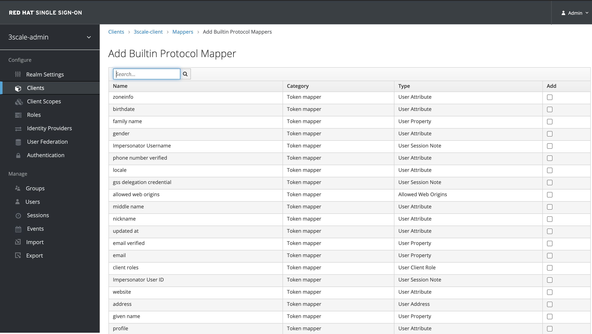

# API Security Workshop

## Description

This Workshop showcase [Red Hat 3Scale API Management](https://www.redhat.com/en/technologies/jboss-middleware/3scale) features leaning towards API Management Security challenges.

The [Additional References](#additional-references) section will provide complementary assets for further reading covering additional details about related topics.

## Environment

- [Red Hat OpenShift Container Platform 4.6](https://docs.openshift.com/container-platform/4.6/welcome/index.html)
- [Red Hat 3Scale API Management 2.9](https://www.redhat.com/en/technologies/jboss-middleware/3scale)
- [OpenShift Service Mesh 2.0.2](https://www.openshift.com/learn/topics/service-mesh)
- [Red Hat Single Sign On 7.4](https://access.redhat.com/products/red-hat-single-sign-on)

## Agenda

In order to facilitate the workshop execution, we´ve organized it on the following modules:

0. [OpenShift Setup](OPENSHIFT_SETUP.md)
1. [3Scale Setup](3SCALE_SETUP.md)
2. [3Scale First API](3SCALE_FIRST_API.md)
3. [3Scale Policies](3SCALE_POLICIES.md)
4. [3Scale Developer Portal](3SCALE_DEV_PORTAL.md)
5. [3Scale Security](3SCALE_SECURITY.md)
6. [3Scale Service Mesh](3SCALE_SERVICE_MESH.md)
7. [3Scale Management](3SCALE_MANAGEMENT.md)

## Deployment

### 9. Security - Deploy RH-SSO <a name="deploy-rhsso">

* Before moving forward, make sure your environment mets the following prerequisites: [Red Hat Single Sign On Requirements](https://access.redhat.com/documentation/en-us/red_hat_single_sign-on/7.4/html-single/red_hat_single_sign-on_for_openshift_on_openjdk/index#initial_setup)

* Double check if you have **RH-SSO Templates** installed:

  ```
  oc get templates -n openshift | grep sso
  eap73-sso-s2i                                       An example JBoss Enterprise Application Platform application Single Sign-On a...   49 (20 blank)     10
  sso72-https                                         An example RH-SSO 7 application. For more information about using this templa...   26 (15 blank)     6
  sso72-mysql                                         An example RH-SSO 7 application with a MySQL database. For more information a...   36 (20 blank)     8
  sso72-mysql-persistent                              An example RH-SSO 7 application with a MySQL database. For more information a...   37 (20 blank)     9
  sso72-postgresql                                    An example RH-SSO 7 application with a PostgreSQL database. For more informat...   33 (17 blank)     8
  sso72-postgresql-persistent                         An example RH-SSO 7 application with a PostgreSQL database. For more informat...   34 (17 blank)     9
  sso73-https                                         An example application based on RH-SSO 7.3 image. For more information about...    27 (16 blank)     6
  sso73-mysql                                         An example application based on RH-SSO 7.3 image. For more information about...    37 (21 blank)     8
  sso73-mysql-persistent                              An example application based on RH-SSO 7.3 image. For more information about...    38 (21 blank)     9
  sso73-ocp4-x509-https                               An example application based on RH-SSO 7.3 image. For more information about...    13 (7 blank)      5
  sso73-ocp4-x509-mysql-persistent                    An example application based on RH-SSO 7.3 image. For more information about...    24 (12 blank)     8
  sso73-ocp4-x509-postgresql-persistent               An example application based on RH-SSO 7.3 image. For more information about...    21 (9 blank)      8
  sso73-postgresql                                    An example application based on RH-SSO 7.3 image. For more information about...    34 (18 blank)     8
  sso73-postgresql-persistent                         An example application based on RH-SSO 7.3 image. For more information about...    35 (18 blank)     9
  sso74-https                                         An example application based on RH-SSO 7.4 on OpenJDK image. For more informa...   27 (16 blank)     6
  sso74-ocp4-x509-https                               An example application based on RH-SSO 7.4 on OpenJDK image. For more informa...   13 (7 blank)      5
  sso74-ocp4-x509-postgresql-persistent               An example application based on RH-SSO 7.4 on OpenJDK image. For more informa...   21 (9 blank)      8
  sso74-postgresql                                    An example application based on RH-SSO 7.4 on OpenJDK image. For more informa...   34 (18 blank)     8
  sso74-postgresql-persistent                         An example application based on RH-SSO 7.4 on OpenJDK image. For more informa...   35 (18 blank)     9
  ```
    * your output may differ from the above, but please, notice that you must have at least one template available in order to deploy **RH-SSO**

* Deploy **RH-SSO**:

  ```
  oc -n 3scale new-app --template=sso74-ocp4-x509-https \
    -p SSO_ADMIN_USERNAME=admin \
    -p SSO_ADMIN_PASSWORD=redhat

    --> Deploying template "openshift/sso74-ocp4-x509-https" to project 3scale

     Red Hat Single Sign-On 7.4 on OpenJDK (Ephemeral)
     ---------
     An example application based on RH-SSO 7.4 on OpenJDK image. For more information about using this template, see https://github.com/jboss-container-images/redhat-sso-7-openshift-image/tree/sso74-dev/docs.

     A new RH-SSO service has been created in your project. The admin username/password for accessing the master realm via the RH-SSO console is admin/redhat. The HTTPS keystore used for serving secure content, the JGroups keystore used for securing JGroups communications, and server truststore used for securing RH-SSO requests were automatically created via OpenShift's service serving x509 certificate secrets.

     * With parameters:
        * Application Name=sso
        * Custom RH-SSO Server Hostname=
        * JGroups Cluster Password=3BWrKCC76P5SmpbmS1Q3nlydjiIsyCQD # generated
        * Datasource Minimum Pool Size=
        * Datasource Maximum Pool Size=
        * Datasource Transaction Isolation=
        * ImageStream Namespace=openshift
        * RH-SSO Administrator Username=admin
        * RH-SSO Administrator Password=redhat
        * RH-SSO Realm=
        * RH-SSO Service Username=
        * RH-SSO Service Password=
        * Container Memory Limit=1Gi

  --> Creating resources ...
    configmap "sso-service-ca" created
    service "sso" created
    service "sso-ping" created
    route.route.openshift.io "sso" created
    deploymentconfig.apps.openshift.io "sso" created
  --> Success
    Access your application via route 'sso-3scale.apps.cluster-51e3.51e3.example.opentlc.com'
    Run 'oc status' to view your app.
  ```

* Double check if **RH-SSO pods** are running:

  ```
  oc get pods | grep -i sso
  sso-1-8bfc9                        1/1     Running     0          105s
  sso-1-deploy                       0/1     Completed   0          108s
  ```

* Obtain **Red Hat SSO Route** by executing:

  ```
  oc get routes -n 3scale | grep sso | awk '{ print $2 }'
  sso-3scale.apps.cluster-51e3.51e3.example.opentlc.com
  ```

* Try to access **Red Hat SSO Console** by click on *Administration Console* and informing the following credentials: `admin / redhat`

  
  

### 10. Security - Configure RH-SSO - Admin Console <a name="deploy-configure-adminconsole-rhsso">

* First of all we need to create a Realm. In order to do this, please place your mouse hover (top left) the *Master* label, and click on **Add Realm**

  

* Inform a name of your choice and click on *Create*. Example: `3scale-admin`

  

    * make sure the *Enabled* option is **ON**

* Now we need to create a client. Click on *Clients* (top left menu below *Realm Settings*) and **Create** button:

  
  

* Now create a client with the following parameters:

  ```
  Client ID: 3scale-client
  Client Protocol: openid-connect
  Root URL: <the output from: oc get routes -n 3scale | grep 3scale-admin | awk '{ print $2 }'>

  oc get routes -n 3scale | grep sso | awk '{ print $2}'
  sso-3scale.apps.cluster-8cb5.8cb5.example.opentlc.com
  ```

  

* Make sure your client configuration has the following settings and click on *Save* button:

  ```
  Enabled: ON
  Consent Required: OFF
  Client Protocol: openid-connect
  Access Type: confidential
  Standard Flow Enabled: ON
  Implicit Flow Enabled: False
  Direct Access Grants Enabled: OFF
  Service Accounts Enabled: OFF
  Authorization Enabled: OFF
  ```

  

* Now we need to take note of our credentials. In order to do this, please click on *Credentials* copy this secret for further use.

  

* Switch to *Mappers* tab and click on *Add Builtin*. Finally select **email_verified** and click on *Add Selected*

  
  

* Click on *Users* (left side menu) and *Add User*

  

* Please inform all required data and click on *Save* button

  

  * fell free to configure a password by clicking on *Credentials* and set a password for this user
  * don´t forget to set **Email Verified: TRUE**

* Switch Back to **3Scale** and click on *Gear icon* (top right menu)

  

* Click on *Users -> SSO Integrations* (left side menu) and *New SSO Integration*

  

* Now you need to inform the client name, secret and realm created on **RH-SSO**. Example:

  ```
  Client: 3scale-client
  Client Secret: 69fff29d-2632-43cf-8fe7-29c5b540093d
  Realm or site: <RH-SSO URL>/auth/realms/3scale-admin
  ```

  

* In order to test this integration, click on *Test authentication flow now* and try to login with your **RH-SSO user**

### 11. Security - Configure RH-SSO - APIs <a name="deploy-configure-apis-rhsso">

* Go back to **RH-SSO** and let´s create a new *Realm* for the APIS: `3scale-api`

  

* Now create a client with **No Root Url**

  

* Make sure your client has the following configuration and click on *Save*:

  ```
  Access Type: confidential
  Implicit Flow Enabled: OFF
  Standard Flow Enabled: OFF
  Direct Access Grants Enabled: OFF
  Service Accounts Enabled: ON
  ```

  

* Navigate to *Service Account Role* and enable **manage-clients** role, moving it to the **Assigned Roles** section.

  

* Finally go to the **Credentials** tab and take note of the *Client´s secret*

* Switch back to **3Scale Dashboard** and click on *HELLO-WORLD-PRODUCT API -> Overview*

  

* Click on *Integration -> Settings* and on the **Authentication** section, select: `OpenID Connect Use OpenID Connect for any OAuth 2.0 flow.`

  

* On the **OPENID CONNECT (OIDC) BASICS** change the *OpenID Connect Issuer*: `https://<CLIENT_ID>:<CLIENT_SECRET>@<HOST>:<PORT>/auth/realms/<REALM_NAME>`

* On the **OIDC AUTHORIZATION FLOW** enable the following flows:

  ```
  Authorization Code Flow
  Service Accounts Flow
  Direct Access Grant Flow
  ```

* Finally on the **CREDENTIALS LOCATIONS** select **HTTP HEADERS** and click on *Update Product*

* Go back to the command line and execute the following:

  ```
  oc -n 3scale get pods | grep zync | grep que
  zync-que-1-deploy                  0/1     Completed   0          7h2m
  zync-que-1-p4w7f                   1/1     Running     2          7h2m
  ```
    * take note of this pod: `zync-que-1-p4w7f`
    * your pod name may differ from the above one;

  ```
  oc oc -n 3scale cat exec zync-que-1-p4w7f cat /etc/pki/tls/cert.pem > zync.pem
  ```
    * double check if this file was generated properly

  ```
  oc -n 3scale create configmap zync-ca-bundle --from-file=./zync.pem
  configmap/zync-ca-bundle created

  oc -n 3scale set volume dc/zync --add --name=zync-ca-bundle --mount-path /etc/pki/tls/zync/zync.pem --sub-path zync.pem --source='{"configMap":{"name":"zync-ca-bundle","items":[{"key":"zync.pem","path":"zync.pem"}]}}'
  deploymentconfig.apps.openshift.io/zync volume updated

  oc -n 3scale patch dc/zync --type=json -p '[{"op": "add", "path": "/spec/template/spec/containers/0/volumeMounts/0/subPath", "value":"zync.pem"}]'

  oc set env dc/zync SSL_CERT_FILE=/etc/pki/tls/zync/zync.pem
  deploymentconfig.apps.openshift.io/zync updated

  oc rollout latest dc/zync
  ```

## Additional References <a name="additional-references">
