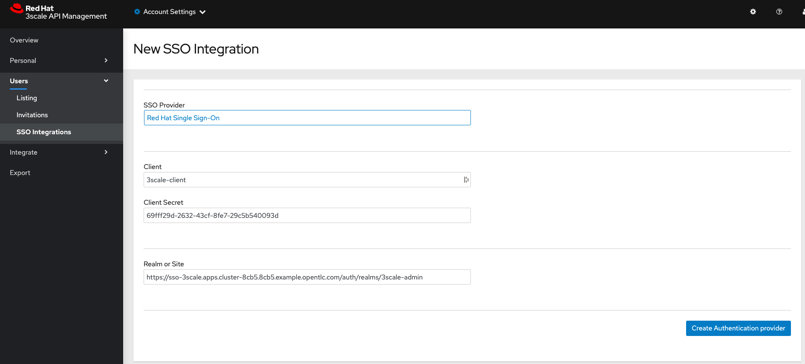

# API Security Workshop

## Description

This Workshop showcase [Red Hat 3Scale API Management](https://www.redhat.com/en/technologies/jboss-middleware/3scale) features leaning towards API Management Security challenges.

The [Additional References](#additional-references) section will provide complementary assets for further reading covering additional details about related topics.

## Environment

- [Red Hat Openshift Container Platform 4.6](https://docs.openshift.com/container-platform/4.6/welcome/index.html)
- [Red Hat 3Scale API Management 2.9](https://www.redhat.com/en/technologies/jboss-middleware/3scale)
- [Openshift Service Mesh 2.0.2](https://www.openshift.com/learn/topics/service-mesh)
- [Red Hat Single Sign On 7.4](https://access.redhat.com/products/red-hat-single-sign-on)

## Agenda

0. [Openshift Setup](#deploy-openshift-setup)
1. [3Scale Setup](#deploy-3scale)
2. [Hello World - Backend](#deploy-helloworld-backend)
3. [Hello World - Product](#deploy-helloworld-product)
4. [Hello World - Mapping Rules](#deploy-helloworld-mappingrules)
5. [Hello World - Application Plans](#deploy-helloworld-applicationplans)
6. [Hello World - Application](#deploy-helloworld-application)
7. [Hello World - Promote](#deploy-helloworld-promote)
8. [Hello World - Test](#deploy-helloworld-test)
9. [Security - Deploy RH-SSO](#deploy-rhsso)
10. [Security - Configure RH-SSO - Admin Console](#deploy-configure-adminconsole-rhsso)
11. [Security - Configure RH-SSO - APIs](#deploy-configure-apis-rhsso)

## Deployment

### 0 - Openshift Setup <a name="deploy-openshift-setup">

* Create a **3Scale project/namespace**. Example: `oc create namespace 3scale`

* Create a  *Kubernetes secret* to fetch images from **Red Hat´s Registry**. Example:

  ```
  oc -n 3scale create secret \
    docker-registry threescale-registry-auth \
    --docker-server=registry.redhat.io \
    --docker-username="someuser" \
    --docker-password="password"
  ```

* Deploy **3Scale Operator** onto **3Scale project/namespace**:
  `Operators > OperatorHub > Red Hat Integration - 3scale`

  

  

  

  * don´t forget to select **3Scale project/namespace**

* Wait for the installation to finish. Before moving forward, we suggest double-checking the successfully deployment of **3Scale´s Operator**:

  

  

* Via *api-resources:*

  ```
  oc api-resources | grep apimanagers
  apimanagers     apps.3scale.net     true      APIManager
  ```

### 1 - 3Scale Setup <a name="deploy-3scale">

* As stated on [3Scale Operator Guide](https://github.com/3scale/3scale-operator/blob/master/doc/operator-user-guide.md#prerequisites) the following requirements must be met:

  ```
  3 RWO (ReadWriteOnce) persistent volumes
  1 RWX (ReadWriteMany) persistent volume
  3scale's System component needs a RWX(ReadWriteMany) PersistentVolume for its FileStorage when System's FileStorage is configured to be a PVC (default behavior). System's FileStorage characteristics:
    Contains configuration files read by the System component at run-time
    Stores Static files (HTML, CSS, JS, etc) uploaded to System by its CMS feature, for the purpose of creating a Developer Portal
    System can be scaled horizontally with multiple pods uploading and reading said static files, hence the need for a RWX PersistentVolume when APIManager is configured to use PVC as System's FileStorage
  ```

    * When using *RHPDS* you need to deploy an additional *Storage Backend (NFS, OCS, etc)* or create a *PersistentVolumeClaim* in order to sucessfully deploy **3Scale**.

      ```
      apiVersion: v1
      kind: PersistentVolumeClaim
      metadata:
        name: system-storage
        labels:
          app: 3scale-api-management
          threescale_component: system
      spec:
        accessModes:
          - ReadWriteOnce
        resources:
          requests:
            storage: "100Mi"
        storageClassName: gp2
        volumeMode: Filesystem

      oc create -f kubernetes/pvc-storage.yml -n 3scale
      persistentvolumeclaim/system-storage created
      ```

    * if you want to customize **3Scale Password** then create a *Kubernetes Secret* with the following content:

      ```
      apiVersion: v1
      kind: Secret
      metadata:
        name: system-seed
      stringData:
        MASTER_USER: admin
        MASTER_PASSWORD: redhat
        MASTER_ACCESS_TOKEN: redhat
        MASTER_DOMAIN: master
        ADMIN_USER: admin
        ADMIN_PASSWORD: redhat
        ADMIN_ACCESS_TOKEN: redhat
        TENANT_NAME: 3scale
      type: Opaque

      oc create -f kubernetes/seed.yml -n 3scale
      secret/system-seed created
      ```

* In order to deploy **3scale**, navigate to `Operators > Installed Operators > Red Hat Integration 3scale -> API Manager > Create APIManager` and deploy the *API Manager*

  

  

* If you prefer to use the command line, then create an *APIManager Object* as follows:

  ```
  apiVersion: apps.3scale.net/v1alpha1
  kind: APIManager
  metadata:
   name: instance-3scale
  spec:
   wildcardDomain: $domain

  oc create -f kubernetes/api-manager.yml -n 3scale
  ```

  * don´t forget to update the *wildcardDomain* section with your **OpenShift Application domain**
  * when using *RHPDS* it´s recommended to disable *Kubernetes Resource Limits* and *Kubernetes Resource Requests* using [resourceRequirementsEnabled: false](https://github.com/3scale/3scale-operator/blob/master/doc/operator-user-guide.md#resources) property:

    ```
    apiVersion: apps.3scale.net/v1alpha1
    kind: APIManager
    metadata:
     name: instance-3scale
    spec:
     wildcardDomain: $domain
     resourceRequirementsEnabled: false

    oc create -f kubernetes/api-manager.yml -n 3scale
    ```

* Wait until all *pods* are successfully started. A similar output is expected:

  ```
  oc get pods -n 3scale

  NAME                               READY   STATUS      RESTARTS   AGE
  3scale-operator-5f59967f75-vvcdm   1/1     Running     0          80m
  apicast-production-1-29nvc         1/1     Running     0          3m39s
  apicast-production-1-deploy        0/1     Completed   0          4m29s
  apicast-staging-1-deploy           0/1     Completed   0          4m29s
  apicast-staging-1-hjvws            1/1     Running     0          3m39s
  backend-cron-1-deploy              0/1     Completed   0          5m18s
  backend-cron-1-lgbfc               1/1     Running     0          5m15s
  backend-listener-1-deploy          0/1     Completed   0          5m19s
  backend-listener-1-m8r4d           1/1     Running     0          5m15s
  backend-redis-1-5hsh9              1/1     Running     0          5m14s
  backend-redis-1-deploy             0/1     Completed   0          5m17s
  backend-worker-1-deploy            0/1     Completed   0          5m19s
  backend-worker-1-w26rn             1/1     Running     0          5m15s
  system-app-1-deploy                0/1     Completed   0          5m
  system-app-1-hook-post             0/1     Completed   0          71s
  system-app-1-hook-pre              0/1     Completed   0          4m58s
  system-app-1-z5ggv                 3/3     Running     0          2m35s
  system-memcache-1-9lxmj            1/1     Running     0          4m59s
  system-memcache-1-deploy           0/1     Completed   0          5m1s
  system-mysql-1-deploy              0/1     Completed   0          5m16s
  system-mysql-1-j4gzq               1/1     Running     0          5m13s
  system-redis-1-deploy              0/1     Completed   0          5m17s
  system-redis-1-dfmqv               1/1     Running     0          5m14s
  system-sidekiq-1-bvb6k             1/1     Running     0          4m53s
  system-sidekiq-1-deploy            0/1     Completed   0          5m1s
  system-sphinx-1-deploy             0/1     Completed   0          5m
  system-sphinx-1-vzt84              1/1     Running     0          4m58s
  zync-1-7zrx7                       1/1     Running     0          4m44s
  zync-1-deploy                      0/1     Completed   0          4m49s
  zync-database-1-deploy             0/1     Completed   0          4m48s
  zync-database-1-h79m6              1/1     Running     0          4m44s
  zync-que-1-deploy                  0/1     Completed   0          4m49s
  zync-que-1-fklk9                   1/1     Running     2          4m44s

  oc get routes -n 3scale | awk '{ print $1, $2 }'
  NAME HOST/PORT
  backend backend-3scale.apps.cluster-620c.620c.example.opentlc.com
  zync-3scale-api-jk8pl api-3scale-apicast-production.apps.cluster-620c.620c.example.opentlc.com
  zync-3scale-api-rgskr api-3scale-apicast-staging.apps.cluster-620c.620c.example.opentlc.com
  zync-3scale-master-wpct6 master.apps.cluster-620c.620c.example.opentlc.com
  zync-3scale-provider-9csj9 3scale-admin.apps.cluster-620c.620c.example.opentlc.com
  zync-3scale-provider-fr9bk 3scale.apps.cluster-620c.620c.example.opentlc.com

  oc get routes -n 3scale | grep 3scale-admin | awk '{ print $2 }'
  3scale-admin.apps.cluster-620c.620c.example.opentlc.com
  ```

* Try to access **3Scale Admin Portal (e.g https://3scale-admin.apps.cluster-620c.620c.example.opentlc.com/)** with the following credentials: `admin / redhat`

  

  

* If something goes wrong please refer to [Troubleshooting common 3scale installation issues](https://access.redhat.com/documentation/en-us/red_hat_3scale_api_management/2.9/html-single/installing_3scale/index#troubleshooting-common-threescale-installation-issues)

### 2 - Hello World API - Backend <a name="deploy-helloworld-backend">

* On your **3Scale Home Page** create a *Backend* with the following configuration, and click on *Create Backend* afterwards:

  

  ```
  Name: hello-world-backend
  System name: hello-world-backend
  Private Base URL: https://echo-api.3scale.net/
  ```

  

* Switch back to **3Scale Home Page** selecting *Dashboard*

  

* For additional information regarding **3Scale Backend** concept please refer to [3Scale Backend](https://access.redhat.com/documentation/en-us/red_hat_3scale_api_management/2.9/html/glossary/threescale_glossary#backend)

### 3 - Hello World API - Product <a name="deploy-helloworld-product">

* On your **3Scale Home Page** create a *Product* with the following configuration, and click on *Create Product* afterwards:

  

  ```
  Name: hello-world-product
  System name: hello-world-product
  ```

  

* On **hello-world-product** page, click on *Integration -> Configuration* and finally: *add a Backend and promote the configuration*:

  

* Select **hello-world-backend** from *Backend* menu and on the *Path* textbox, inform `/`

  

* Finally click on *Add to Product*

  

* For additional information regarding **3Scale Product** concept please refer to [3Scale Product](https://access.redhat.com/documentation/en-us/red_hat_3scale_api_management/2.9/html/glossary/threescale_glossary#product)

### 4 - Hello World API - Mapping Rules <a name="deploy-helloworld-mappingrules">

* Switch back to **3Scale Home Page** selecting *Dashboard*

  

* Edit **hello-world-backend** configuration: *Backends -> hello world backend*

  

* Click on *Mapping Rules* on the left side menu

  

* Click on *Add Mapping Rule* and add a Rule with the following parameters, and afterwards click on *Create Mapping Rule*

  ```
  Verb: GET
  Pattern: /hello
  Metric or method to increment: Hits
  Increment by: 1.
  Last?: blank
  Position: 1
  ```

  

* For additional information regarding **3Scale Mapping Rules** concept please refer to [3Scale Product](https://access.redhat.com/documentation/en-us/red_hat_3scale_api_management/2.9/html/glossary/threescale_glossary#mapping-rule)

### 5. Hello World API - Application Plans <a name="deploy-helloworld-applicationplans">

* Switch back to **3Scale Home Page** selecting *Dashboard*

  

* Switch to *Products* tab and click on *HELLO-WORLD-PRODUCT API*

  

* Click on: *Overview -> Applications -> Application Plan*

  

* Click on *Create Application Plan* and define it using the following parameters:

  ```
  Name: hello-application-plan
  System name: hello-application-plan
  ```

  

* Finally set **hello-application-plan** as the *Default Plan* and click on *Publish*

  

  * wait until **hello-application-plan State** is: *published*

* For additional information regarding **3Scale Application Plan** concept please refer to [3Scale Product](https://access.redhat.com/documentation/en-us/red_hat_3scale_api_management/2.9/html/glossary/threescale_glossary#plan)

### 6. Hello World API - Application <a name="deploy-helloworld-application">

* Switch to **Audience**

  

* Click on *Developer*

  

  

* Click on *1 Application* top link and finally select *Create Application*

  

  

* Define an application with the following configuration and click on *Create Application*

  ```
  Application Plan: hello-application-plan
  Name: hello-world-app
  Description: hello-world-app
  ```

  

  

* For additional information regarding **3Scale Application** concept please refer to [3Scale Product](https://access.redhat.com/documentation/en-us/red_hat_3scale_api_management/2.9/html/glossary/threescale_glossary#application)

### 7. Hello World API - Promote <a name="deploy-helloworld-promote">

* In the left menu, select: *Integration -> Configuration*

  

* Promote the **API** by clicking on *Promote v.1 to Staging APIcast*

  

    * take note of *Staging APIcast URL*

* Promote the **API** by clicking on *Promote v.1 to Production APIcast*

  

    * take note of *Production APIcast URL*

### 8. Hello World API - Test <a name="deploy-helloworld-test">

* In order to test the **Staging APICast**, just execute a curl on the generated URL:

  ```
  curl "https://hello-world-produc-3scale-apicast-staging.apps.cluster-51e3.51e3.example.opentlc.com:443/?user_key=<yourkey>"

  {
  "method": "GET",
  "path": "/",
  "args": "user_key=3103a2e304a1fa4541c8efc34ab0d93d",
  "body": "",
  "headers": {
    "HTTP_VERSION": "HTTP/1.1",
    "HTTP_HOST": "echo-api.3scale.net",
    "HTTP_ACCEPT": "*/*",
    "HTTP_USER_AGENT": "curl/7.64.1",
    "HTTP_X_3SCALE_PROXY_SECRET_TOKEN": "Shared_secret_sent_from_proxy_to_API_backend_77ad267d49292f55",
    "HTTP_X_REAL_IP": "10.128.2.23",
    "HTTP_X_FORWARDED_FOR": "187.2.139.101, 52.22.150.143, 10.0.101.74",
    "HTTP_X_FORWARDED_HOST": "echo-api.3scale.net",
    "HTTP_X_FORWARDED_PORT": "443",
    "HTTP_X_FORWARDED_PROTO": "https",
    "HTTP_FORWARDED": "for=10.0.101.74;host=echo-api.3scale.net;proto=https"
  },
  "uuid": "3109ab09-4bba-49f6-b034-bc078ed1d923"
  }%
  ```

  

* In order to test the **Production APICast**, just execute a curl on the generated URL:

  ```
  curl https://hello-world-produc-3scale-apicast-production.apps.cluster-51e3.51e3.example.opentlc.com:443/\?user_key\=$user_key
  {
    "method": "GET",
    "path": "/",
    "args": "user_key=3103a2e304a1fa4541c8efc34ab0d93d",
    "body": "",
    "headers": {
      "HTTP_VERSION": "HTTP/1.1",
      "HTTP_HOST": "echo-api.3scale.net",
      "HTTP_ACCEPT": "*/*",
      "HTTP_USER_AGENT": "curl/7.64.1",
      "HTTP_X_3SCALE_PROXY_SECRET_TOKEN": "Shared_secret_sent_from_proxy_to_API_backend_77ad267d49292f55",
      "HTTP_X_REAL_IP": "10.131.0.17",
      "HTTP_X_FORWARDED_FOR": "187.2.139.101, 50.16.42.192, 10.0.101.74",
      "HTTP_X_FORWARDED_HOST": "echo-api.3scale.net",
      "HTTP_X_FORWARDED_PORT": "443",
      "HTTP_X_FORWARDED_PROTO": "https",
      "HTTP_FORWARDED": "for=10.0.101.74;host=echo-api.3scale.net;proto=https"
    },
    "uuid": "ca1d231b-5b7b-4f32-b246-a338de792f5c"
  }
  ```

  

### 9. Security - Deploy RH-SSO <a name="deploy-rhsso">

* Before moving forward, make sure your environment mets the following prerequisites: [Red Hat Single Sign On Requirements](https://access.redhat.com/documentation/en-us/red_hat_single_sign-on/7.4/html-single/red_hat_single_sign-on_for_openshift_on_openjdk/index#initial_setup)

* Double check if you have **RH-SSO Templates** installed:

  ```
  oc get templates -n openshift | grep sso
  eap73-sso-s2i                                       An example JBoss Enterprise Application Platform application Single Sign-On a...   49 (20 blank)     10
  sso72-https                                         An example RH-SSO 7 application. For more information about using this templa...   26 (15 blank)     6
  sso72-mysql                                         An example RH-SSO 7 application with a MySQL database. For more information a...   36 (20 blank)     8
  sso72-mysql-persistent                              An example RH-SSO 7 application with a MySQL database. For more information a...   37 (20 blank)     9
  sso72-postgresql                                    An example RH-SSO 7 application with a PostgreSQL database. For more informat...   33 (17 blank)     8
  sso72-postgresql-persistent                         An example RH-SSO 7 application with a PostgreSQL database. For more informat...   34 (17 blank)     9
  sso73-https                                         An example application based on RH-SSO 7.3 image. For more information about...    27 (16 blank)     6
  sso73-mysql                                         An example application based on RH-SSO 7.3 image. For more information about...    37 (21 blank)     8
  sso73-mysql-persistent                              An example application based on RH-SSO 7.3 image. For more information about...    38 (21 blank)     9
  sso73-ocp4-x509-https                               An example application based on RH-SSO 7.3 image. For more information about...    13 (7 blank)      5
  sso73-ocp4-x509-mysql-persistent                    An example application based on RH-SSO 7.3 image. For more information about...    24 (12 blank)     8
  sso73-ocp4-x509-postgresql-persistent               An example application based on RH-SSO 7.3 image. For more information about...    21 (9 blank)      8
  sso73-postgresql                                    An example application based on RH-SSO 7.3 image. For more information about...    34 (18 blank)     8
  sso73-postgresql-persistent                         An example application based on RH-SSO 7.3 image. For more information about...    35 (18 blank)     9
  sso74-https                                         An example application based on RH-SSO 7.4 on OpenJDK image. For more informa...   27 (16 blank)     6
  sso74-ocp4-x509-https                               An example application based on RH-SSO 7.4 on OpenJDK image. For more informa...   13 (7 blank)      5
  sso74-ocp4-x509-postgresql-persistent               An example application based on RH-SSO 7.4 on OpenJDK image. For more informa...   21 (9 blank)      8
  sso74-postgresql                                    An example application based on RH-SSO 7.4 on OpenJDK image. For more informa...   34 (18 blank)     8
  sso74-postgresql-persistent                         An example application based on RH-SSO 7.4 on OpenJDK image. For more informa...   35 (18 blank)     9
  ```
    * your output may differ from the above, but please, notice that you must have at least one template available in order to deploy **RH-SSO**

* Deploy **RH-SSO**:

  ```
  oc -n 3scale new-app --template=sso74-ocp4-x509-https \
    -p SSO_ADMIN_USERNAME=admin \
    -p SSO_ADMIN_PASSWORD=redhat

    --> Deploying template "openshift/sso74-ocp4-x509-https" to project 3scale

     Red Hat Single Sign-On 7.4 on OpenJDK (Ephemeral)
     ---------
     An example application based on RH-SSO 7.4 on OpenJDK image. For more information about using this template, see https://github.com/jboss-container-images/redhat-sso-7-openshift-image/tree/sso74-dev/docs.

     A new RH-SSO service has been created in your project. The admin username/password for accessing the master realm via the RH-SSO console is admin/redhat. The HTTPS keystore used for serving secure content, the JGroups keystore used for securing JGroups communications, and server truststore used for securing RH-SSO requests were automatically created via OpenShift's service serving x509 certificate secrets.

     * With parameters:
        * Application Name=sso
        * Custom RH-SSO Server Hostname=
        * JGroups Cluster Password=3BWrKCC76P5SmpbmS1Q3nlydjiIsyCQD # generated
        * Datasource Minimum Pool Size=
        * Datasource Maximum Pool Size=
        * Datasource Transaction Isolation=
        * ImageStream Namespace=openshift
        * RH-SSO Administrator Username=admin
        * RH-SSO Administrator Password=redhat
        * RH-SSO Realm=
        * RH-SSO Service Username=
        * RH-SSO Service Password=
        * Container Memory Limit=1Gi

  --> Creating resources ...
    configmap "sso-service-ca" created
    service "sso" created
    service "sso-ping" created
    route.route.openshift.io "sso" created
    deploymentconfig.apps.openshift.io "sso" created
  --> Success
    Access your application via route 'sso-3scale.apps.cluster-51e3.51e3.example.opentlc.com'
    Run 'oc status' to view your app.
  ```

* Double check if **RH-SSO pods** are running:

  ```
  oc get pods | grep -i sso
  sso-1-8bfc9                        1/1     Running     0          105s
  sso-1-deploy                       0/1     Completed   0          108s
  ```

* Obtain **Red Hat SSO Route** by executing:

  ```
  oc get routes -n 3scale | grep sso | awk '{ print $2 }'
  sso-3scale.apps.cluster-51e3.51e3.example.opentlc.com
  ```

* Try to access **Red Hat SSO Console** by click on *Administration Console* and informing the following credentials: `admin / redhat`

  
  

### 10. Security - Configure RH-SSO - Admin Console <a name="deploy-configure-adminconsole-rhsso">

* First of all we need to create a Realm. In order to do this, please place your mouse hover (top left) the *Master* label, and click on **Add Realm**

  

* Inform a name of your choice and click on *Create*. Example: `3scale-admin`

  

    * make sure the *Enabled* option is **ON**

* Now we need to create a client. Click on *Clients* (top left menu below *Realm Settings*) and **Create** button:

  
  

* Now create a client with the following parameters:

  ```
  Client ID: 3scale-client
  Client Protocol: openid-connect
  Root URL: <the output from: oc get routes -n 3scale | grep 3scale-admin | awk '{ print $2 }'>

  oc get routes -n 3scale | grep sso | awk '{ print $2}'
  sso-3scale.apps.cluster-8cb5.8cb5.example.opentlc.com
  ```

  

* Make sure your client configuration has the following settings and click on *Save* button:

  ```
  Enabled: ON
  Consent Required: OFF
  Client Protocol: openid-connect
  Access Type: confidential
  Standard Flow Enabled: ON
  Implicit Flow Enabled: False
  Direct Access Grants Enabled: OFF
  Service Accounts Enabled: OFF
  Authorization Enabled: OFF
  ```

  

* Now we need to take note of our credentials. In order to do this, please click on *Credentials* copy this secret for further use.

  

* Switch to *Mappers* tab and click on *Add Builtin*. Finally select **email_verified** and click on *Add Selected*

  
  

* Click on *Users* (left side menu) and *Add User*

  

* Please inform all required data and click on *Save* button

  

  * fell free to configure a password by clicking on *Credentials* and set a password for this user
  * don´t forget to set **Email Verified: TRUE**

* Switch Back to **3Scale** and click on *Gear icon* (top right menu)

  

* Click on *Users -> SSO Integrations* (left side menu) and *New SSO Integration*

  

* Now you need to inform the client name, secret and realm created on **RH-SSO**. Example:

  ```
  Client: 3scale-client
  Client Secret: 69fff29d-2632-43cf-8fe7-29c5b540093d
  Realm or site: <RH-SSO URL>/auth/realms/3scale-admin
  ```

  

* In order to test this integration, click on *Test authentication flow now* and try to login with your **RH-SSO user**

### 11. Security - Configure RH-SSO - APIs <a name="deploy-configure-apis-rhsso">

* Go back to **RH-SSO** and let´s create a new *Realm* for the APIS: `3scale-api`

  

* Now create a client with **No Root Url**

  

* Make sure your client has the following configuration and click on *Save*:

  ```
  Access Type: confidential
  Implicit Flow Enabled: OFF
  Standard Flow Enabled: OFF
  Direct Access Grants Enabled: OFF
  Service Accounts Enabled: ON
  ```

  

* Navigate to *Service Account Role* and enable **manage-clients** role, moving it to the **Assigned Roles** section.

  

* Finally go to the **Credentials** tab and take note of the *Client´s secret*

  ```
  export access_token=$(\
    curl -X POST https://sso-3scale.apps.cluster-8cb5.8cb5.example.opentlc.com/auth/realms/3scale-api/protocol/openid-connect/token \
    --user 2566441d:a5d3e108a3a7b6d42d55a72d473853df \
    -H 'content-type: application/x-www-form-urlencoded' \
    -d 'username=3scale-api&password=redhat&grant_type=password' | jq --raw-output '.access_token' \
  )

  curl -H "Authorization: Bearer $access_token"  \
    https://hello-world-product-3scale-apicast-staging.apps.cluster-8cb5.8cb5.example.opentlc.com:443/hello
  ```

## Additional References <a name="additional-references">
